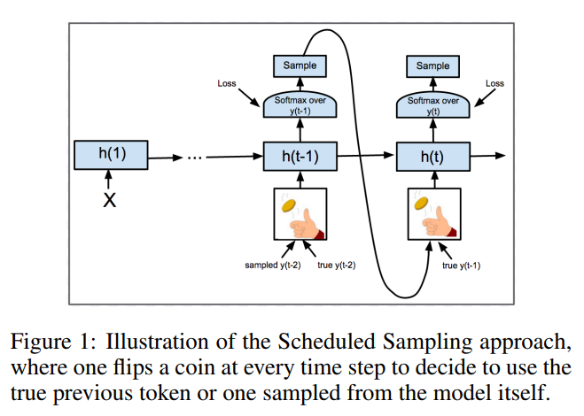

# Title: Effective Approaches to Attention-based Neural Machine Translation
+ Referrer: HJ, Level: 10
+ Reasons: propose one of the most used attention mechanism
+ [PDF Link](https://arxiv.org/pdf/1506.03099.pdf)  
+ Organization: Stanford
+ Ref: 	Thang Luong, Hieu Pham, Christopher D. Manning: Effective Approaches to Attention-based Neural Machine Translation. EMNLP 2015: 1412-1421

# Contributions
This paper examines two simple and effective classes of attentional mechanism: a global approach which always attends to all source words and a local one that only looks at a subset of source words at a time.

# Model Structure

