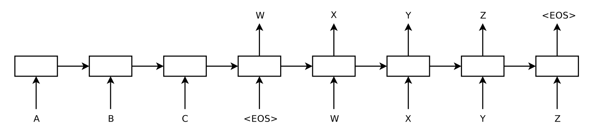

# Title Sequence to Sequence Learning with Neural Networks
+ Referrer: HJ, Level: 10
+ Reasons: One of the first paper about the Encoder-decoder model.
+ Proceedings or Journal: arxiv
+ [PDF Link](https://arxiv.org/pdf/1409.3215.pdf)  
+ Organization: Google
+ Authors: Ilya Sutskever, Oriol Vinyals, Quoc V. Le

# Contributions
+ Propose a general end-to-end approach to sequence learning that makes minimal assumptions on the sequence structure.
+ This method uses a multilayered long short-term memory to map the input sequence to a vector of a fixed dimensionality, and then another deep LSTM to decode the target sequence from the vector.
++ So how to generate more efficient vector? You can use Attention mechanism.

# Dataset
 + an English to French translation task dataset WMT'14
 
 
# Algorithm
+ Model Structure

   
+ First, the input sequence (ABC) and the output sequence(WXYZ) have different length.
+ The decoder LSTM stops making prediction after outputing the end-of-sentence (EOS) token.

The actual models differ from the above description in three important ways. 
+ They used two different LSTMs: one for the input sequence and another for the output sequence, because doing so increases the number model parameters at negligible computational cost and makes it natural to train the LSTM on multiple language pairs simultaneously. 
+ They found that deep LSTM significantly outperformed shallow LSTMs, so they chose an LSTM with four layers. 
+ They found it extremely valuable to reverse the order of the words of the input sentence. So for example, instead of mapping the sentence a, b, c to the sentence α, β, γ, the LSTM is asked to map c, b, a to α, β, γ, where α, β, γ is the translation of a, b, c. This way, a is in close proximity to α, b is fairly close to β, and so on, a fact that makes it easy for SGD to “establish communication” between the input and the output. They found this simple data transformation to greatly improve the performance of the LSTM.
